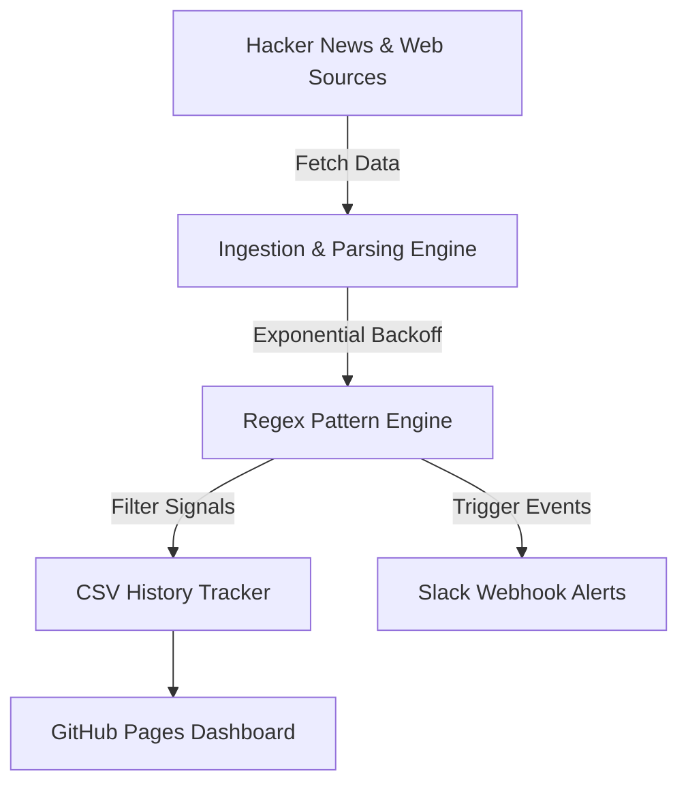

# 🔎 TrendWatch

An automated, serverless market intelligence engine that monitors developer platforms (e.g., Hacker News) for product launches, funding rounds, and acquisitions — dispatching structured real-time alerts to **Slack** and updating a live **public dashboard** with zero manual overhead.

**🔗 Live Dashboard:** [yosserayari.github.io/trendwatch/dashboard](https://yosserayari.github.io/trendwatch/dashboard/)

---



## 🎯 What Problem It Solves

Generic keyword tracking (e.g., searching for any post mentioning "AI") produces excessive noise—mostly opinion pieces, casual threads, and off-topic discussions. 

**TrendWatch** solves this by enforcing **signal-pattern matching** bound to verified market events:
* **Product Launches** (*"Show HN," "Introducing," "Launch"*)
* **Capital Flows** (*"raises $," "Series A," "backed by"*)
* **M&A Activity** (*"acquired by," "merger," "joins forces"*)

---

## ✨ Key Features

- 🎯 **Signal-Based Precision Engine:** Uses exact regex word-boundary logic to eliminate false positives from substring overlaps.
- 💬 **Real-Time Slack Alerts:** Formatted Block Kit webhook messages dispatched instantly when actionable signals are detected.
- ⚡ **Zero-Server Automation:** Powered entirely by scheduled GitHub Actions workflows running twice daily.
- 📈 **Persistent Historical Storage:** Maintains a continuous data log to track trends over time rather than dropping old state.
- 📊 **Decoupled Frontend:** Static public dashboard built with clean HTML/CSS and PapaParse, reading CSV data asynchronously without requiring a database server.
- 🔌 **Modular Source Architecture:** Abstracted parser design—adding new data sources (Reddit, job boards, RSS feeds) only requires writing a single isolated module without altering the core pipeline.

---

## 🛠️ Tech Stack

* **Backend Engine:** Python (`requests`, `beautifulsoup4`, `pandas`, `pyyaml`)
* **Automation Orchestration:** GitHub Actions (Scheduled CRON + manual triggers)
* **Integrations:** Slack Incoming Webhook API
* **Frontend Dashboard:** Static HTML5 / CSS3 / JavaScript (`PapaParse`)

---

## 📂 Project Structure

```text
trendwatch/
├── .github/workflows/    # Scheduled GitHub Actions automation tasks
├── src/                  # Source parsers and core extraction engine
│   ├── parsers/          # Modular site-specific scraper modules
│   ├── sanitizer.py      # String cleanup & regex pattern validator
│   └── webhook.py        # Slack alert dispatcher
├── dashboard/            # Static dashboard source code
│   ├── index.html
│   └── app.js
├── config.yml            # User-defined keywords, signals, and sources
└── requirements.txt      # Python dependencies
